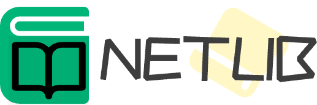

# Library-management-system
## Description

### logo



### introduction

a website for user to download and share books easily on the Internet

### views

### language

- Vue

- Go 

### technology stack 

- Vue-cli 

- Axious

- Element UI

- Gin

- Gorm 

- Mysql/Redis


### current


### demo for view

<http://122.9.215.185>

## Vision

> v1.0.0

- 发布基本功能包括用户登录、图书检索和收藏

## Characher

## Construction
 
## Project setup
```
npm install
```

### Compiles and hot-reloads for development
```
npm run serve
```

### Compiles and minifies for production
```
npm run build
```

### Lints and fixes files
```
npm run lint
```

## Contributors

[xuedingedejumao](https://github.com/xuedingedejumao) 

[aaaris](https://github.com/aaaris)

## Thanks

<https://v3.cn.vuejs.org/guide/introduction.html>

<https://element.eleme.cn/>